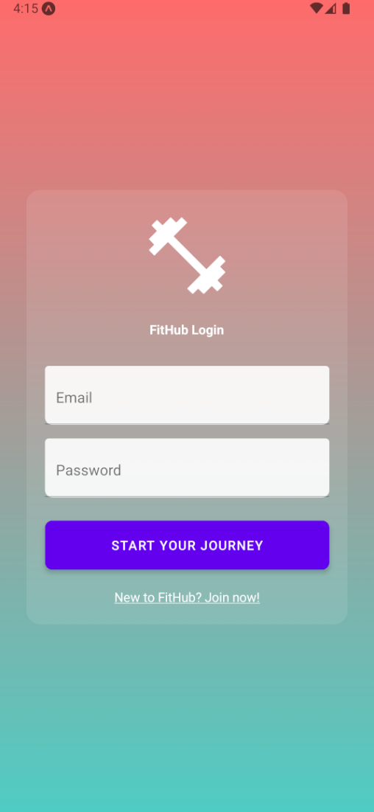
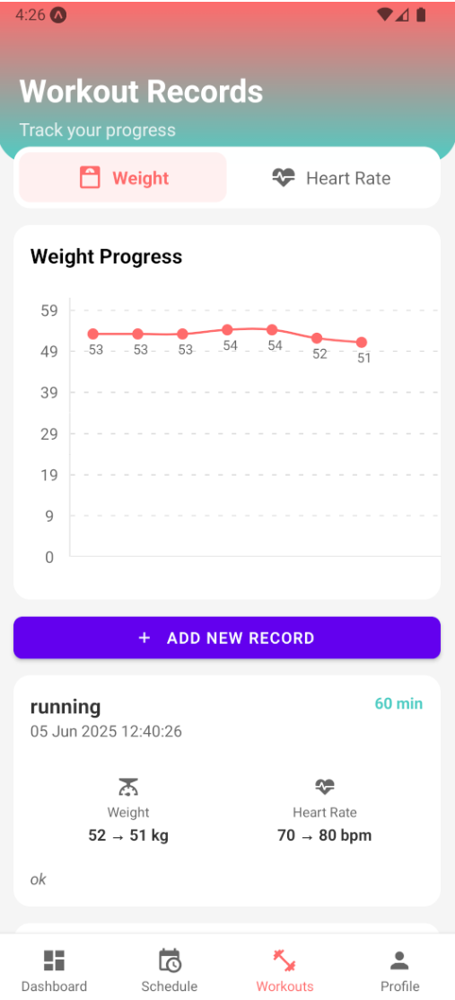
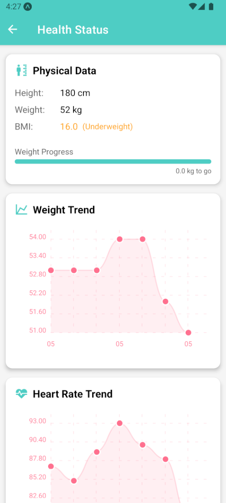
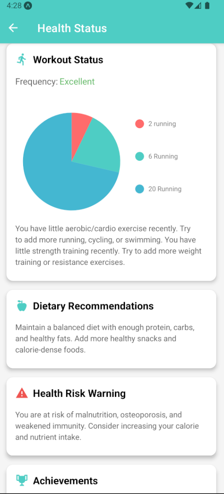
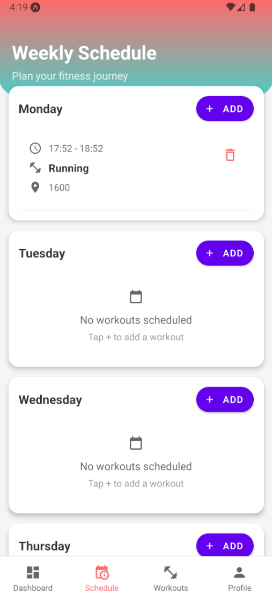
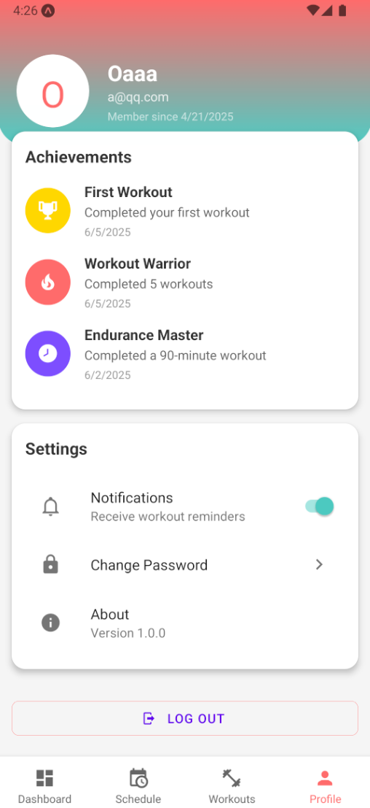
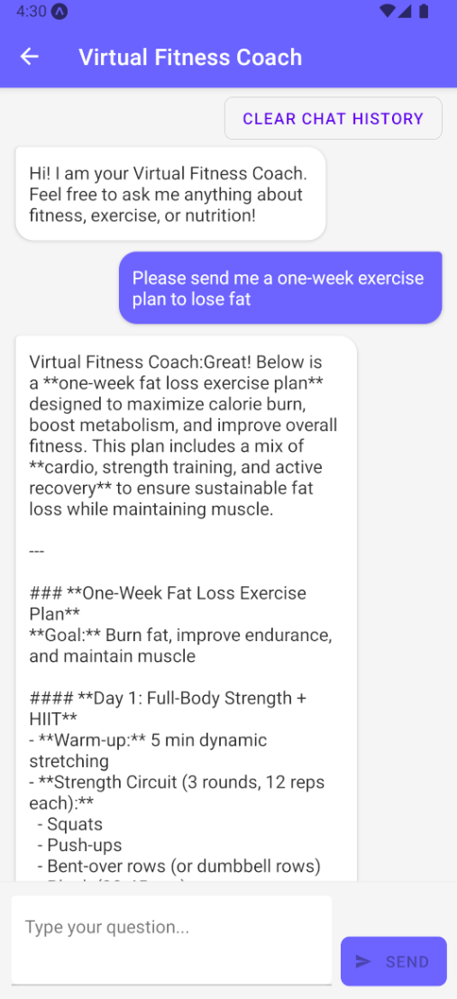

# 🧠 Health Monitoring App (Final Year Project)

A cross-platform mobile fitness app developed using **React Native**, **Firebase**, and **Redux**, built to help users track health metrics and stay on top of their wellness goals.

---

## 🚀 Features

- 🔐 User login / registration (Firebase Auth)
- 📊 Track BMI, workout logs, heart rate
- 📆 Weekly workout planner
- 🧠 AI fitness chatbot using DeepSeek API
- 📉 Admin dashboard (ECharts.js + Firebase Web)
- 🌐 Real-time sync with offline support (AsyncStorage)

---

## 🛠️ Tech Stack

| Technology | Purpose |
|------------|---------|
| React Native (Expo) | Cross-platform UI |
| Firebase | Auth, Firestore |
| Redux Toolkit | Global state management |
| JavaScript / JSX | Core logic |
| ECharts.js | Admin dashboard charts |
| DeepSeek API | Chatbot AI |
| AsyncStorage | Offline mode |

---

## 📂 Folder Structure

expo-fitness-app/
├── assets/
├── firebase/
├── redux/
├── pages/
├── routes/
├── utils/
├── App.js
└── package.json

## 📷 Screenshots

### 🔐 Login Page

### 📊 Dashboard

### 💪 Workout Tracker

### 🧠 Health Status

### 🧠 Health Status (Detail)

### 🗓️ Weekly Schedule

### 🧬 Profile Page

### 🤖 AI Chatbot

## 👨‍💻 Author

**Tong Wai Yin**  
📧 a2022938515@gmail.com  
🔗 [LinkedIn](https://linkedin.com/in/wai-yin-tong-2977b5246)

---

## 📄 License

Open-source for academic, demo, and non-commercial use.